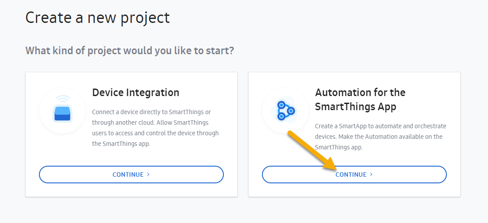
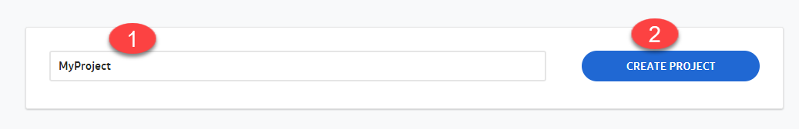
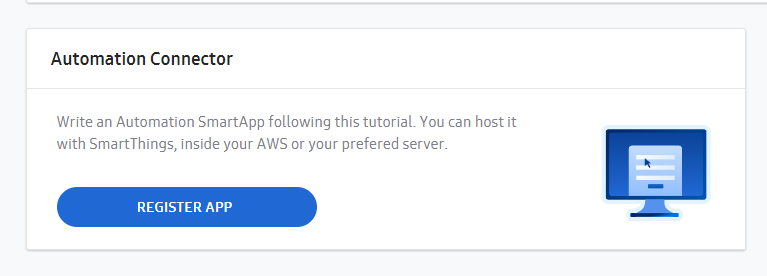
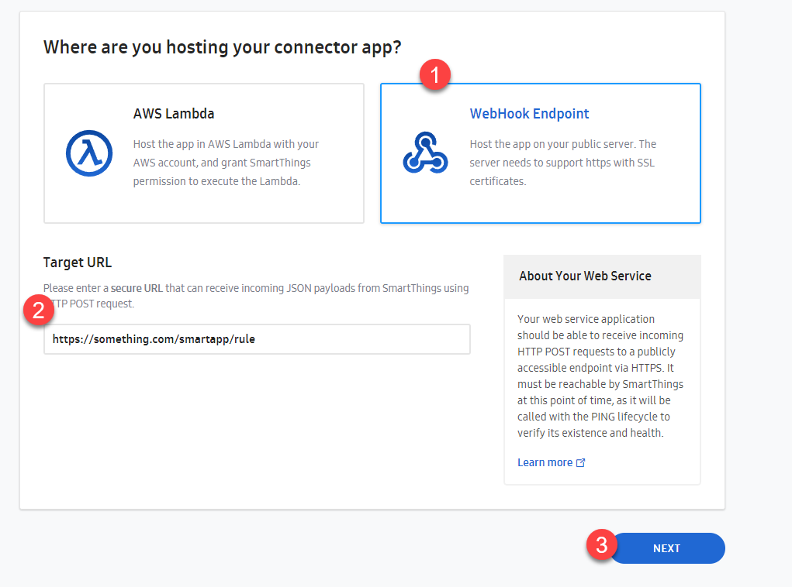
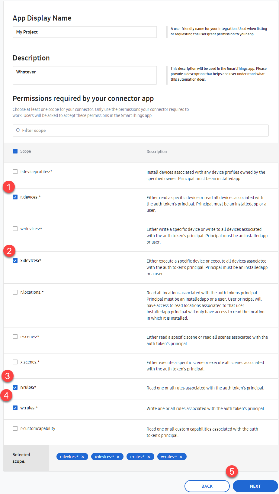
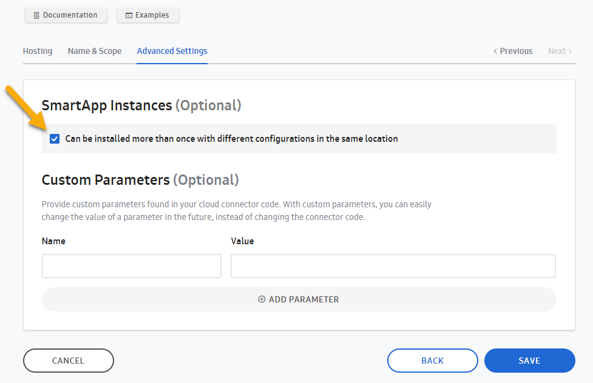
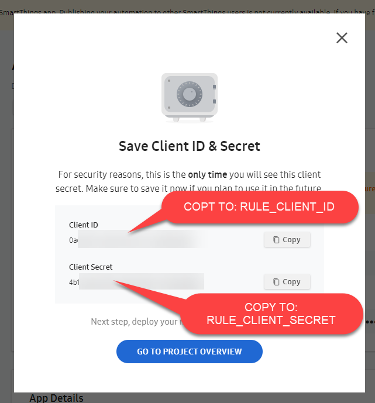
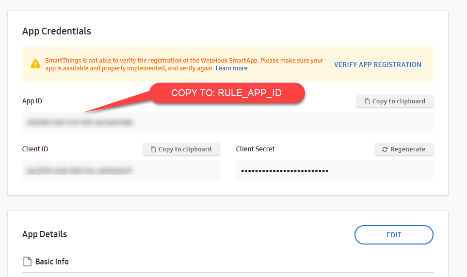
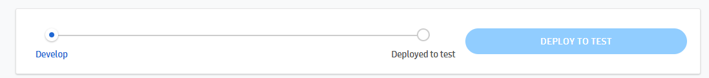

# Creating The SmartThings Workspace Project

## Go To [Your Samsung Projects Workspace](https://smartthings.developer.samsung.com/workspace/projects) 
1) Create a **FREE** account first if necessary

## Create a 'New Project'

### Create an new project 

### Give it any name

### Register the app

### WebHook Endpoint, Target URL: `https://something.com/smartapp/rule` 
- for now, we will update this in a bit! 

### Any Name, Any Description, **SELECT THE FOLLOWING SCOPES**
   - `r:devices*` (so app can read devices during config)
   - `x:devices` (maybe not necessary for this app, but this would allow device execution from webapp)
   - `r:rules:*` (read saved rules associated with this appid,clientid,secret)
   - `w:rules:*` (save rules created by this smartapp)

### Check box saying 'Can be installed more than once...'

### Copy values to `server/.env.local` 
- Copy _Client ID_ value to `RULE_CLIENT_ID` in `server/.env.local`
- Copy _Client Secret_ value to `RULE_CLIENT_SECRET` in `server/.env.local` (IMPORTANT, IF YOU LOSE THIS YOU WILL HAE TO REGENERATE IT)

### Copy _App ID_ value to `RULE_APP_ID` in `server/.env.local`

### Go to 'Overview' for your project and 'Deploy To Test'

- This is the step that makes the app available for install on the 'SmartApp' screen once it is running successfully

 