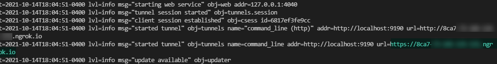
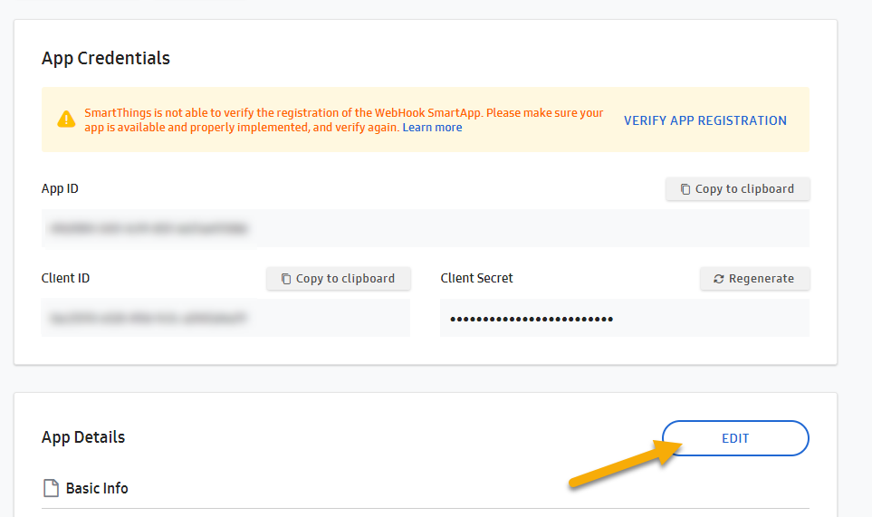
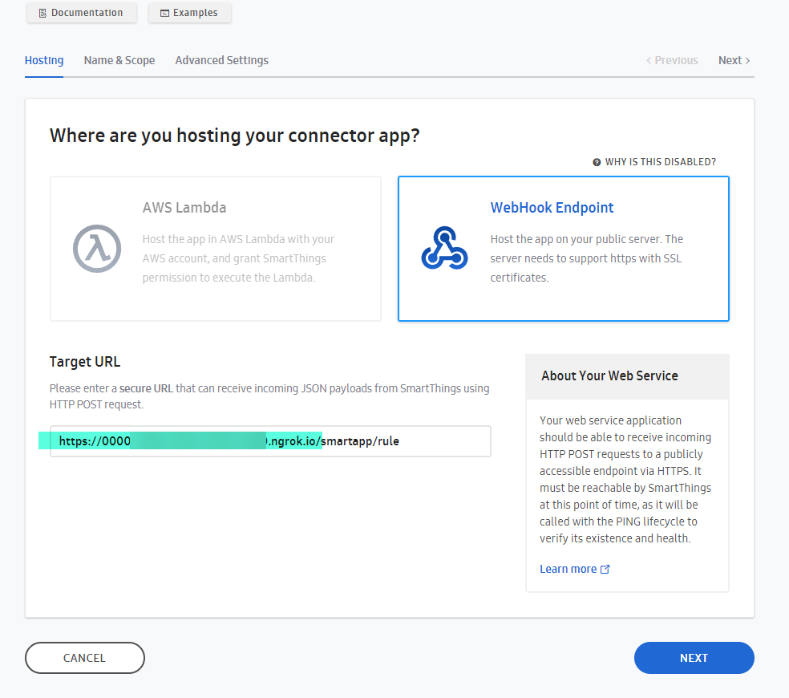
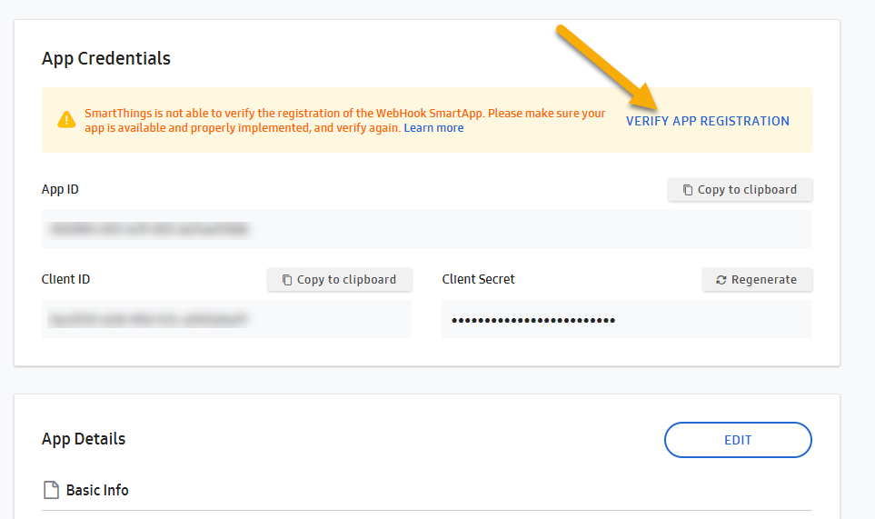
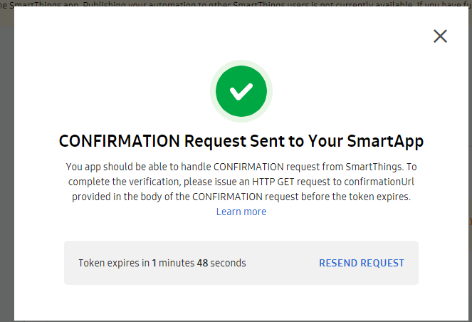
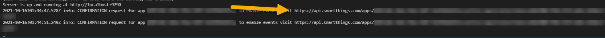

# (Re)Verify The App Registration

## Copy the value output in `yarn tunnel` task output for the 'https' url

## Paste to your application configuration

### Edit The Existing App      

### Edit the Target URL

- **ONLY MODIFY** ngrok hostname, do not remove the `/smartapp/rule` path

### Next, Next, Save (Making no other changes)

## Verify your App Registration 

### Step 1

### Step 2

 

## **Go to the output of the `yarn start` task** and follow this link

 

 ## Once successful, after a refresh, the 'Verify App Registration' link and message (from screenshot in step #1) will go away from the app management screen